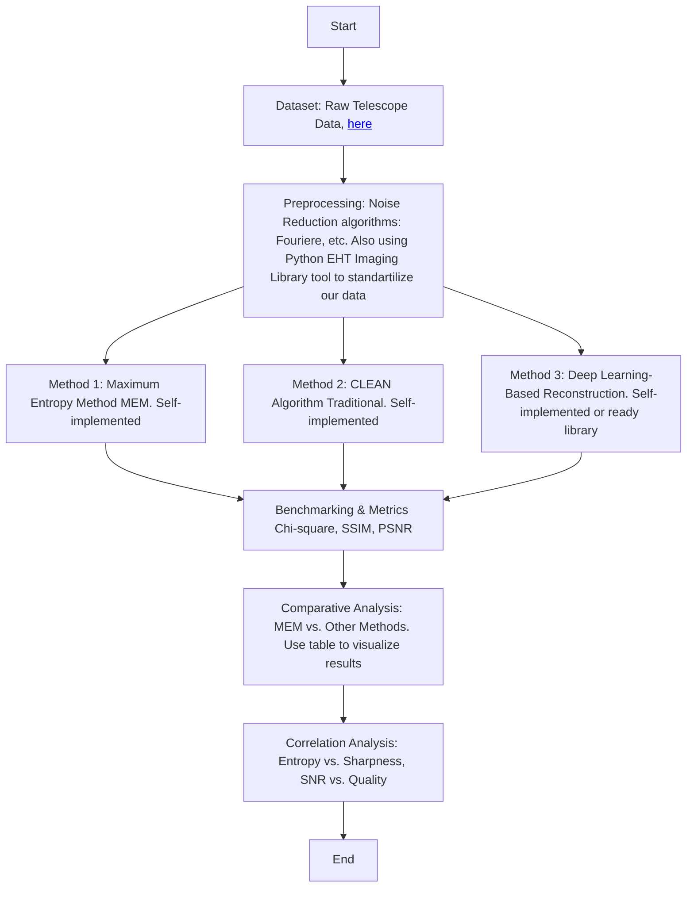

**Brief Explanation: Maximum Entropy Image Reconstruction for Astrophysics**

This numerical experiment explores the application of the **Maximum Entropy Method (MEM)** for reconstructing astrophysical images. The process begins with raw telescope data obtained from sources such as **radio interferometry (ALMA, VLA) or X-ray telescopes (Chandra)**. The dataset undergoes preprocessing, including **Fourier transformation and noise reduction**, to extract visibility functions for image reconstruction. The more information we find <a href='http://vlbiimaging.csail.mit.edu/imagingchallenge'>here</a>

Following preprocessing, three different reconstruction methods are applied:
1. **MEM:** Uses entropy maximization to generate the most probable image given the data constraints.
2. **CLEAN Algorithm:** A traditional deconvolution approach commonly used in radio astronomy.
3. **Deep Learning-Based Reconstruction:** Utilizes machine learning models trained on astrophysical datasets to enhance resolution.

After applying these methods, the results are evaluated using **benchmarking metrics** such as:
- **Chi-square goodnesPs of fit** to measure data consistency.
- **Structural Similarity Index (SSIM)** for image quality assessment.
- **Peak Signal-to-Noise Ratio (PSNR)** to quantify noise suppression.

A **comparative analysis** is performed to assess the strengths and weaknesses of each method. Additionally, a **correlation analysis** investigates relationships between entropy and image sharpness, as well as signal-to-noise ratio (SNR) and reconstruction quality.

The flowchart visually represents this process, illustrating the step-by-step progression from data acquisition to final analysis, ensuring a structured and repeatable approach for image reconstruction in astrophysics.

Changelogs

Changelog – Maximum Entropy Image Reconstruction for Radio
Astronomy using Python library

1. General Structure
- Modified: Title capitalization and formatting refined in the PDF.
- Added: Proper section numbering and formatting.
- Modified: Improved layout with spacing, figure captions, and page breaks.

2. Abstract
- Modified: Improved wording and sentence structure
- Added: Correct punctuation and grammar.
- Modified: "provide numerical experiments" → "provides numerical experiments".

3. I. Research Proposal
- Modified: Sentences restructured for clarity and flow.
- Added: Philosophical basis for modeling better explained.

4. II. Introduction
- Modified: Grammar fixes
- Added: Clarified the relationship between physical models and engineering use.

5. III. Modeling of Physical and Mathematical Model
- Modified: Equations are formatted more clearly.
- Added: Better variable explanations and structure.

6. IV. Modeling of Information Model
- Modified: Improved academic language and structure.
- Added: Clear definitions of entropy and digital image characteristics.

7. V. Modeling Numerical Model
- Modified: Clearer link between image properties and numerical data.
- Added: Expanded on how is used in computation.

8. VI. Experiments
- Modified: Subsections (“Objective,” “Methodology,” “Implementation”) improved.
- Added: Enhanced formatting and explanation of code functions.

9. Code
- Modified: Python functions and docstrings cleaned and aligned.
- Added: Code blocks more readable and syntactically correct in PDF.

10. VII. Results and Analysis
- Added: Figure caption and clearer context of entropy result.
- Modified: Language improved for explaining outcomes.

11. VIII. Conclusions and Possible Improvements
- Modified: Grammar fixed
- Added: Clear statement about future research directions (e.g., medical imaging).

Summary:
- Final version includes better formatting, grammar, and complete code.
- Clearer structure and explanations throughout.
- More polished and publication-ready.

