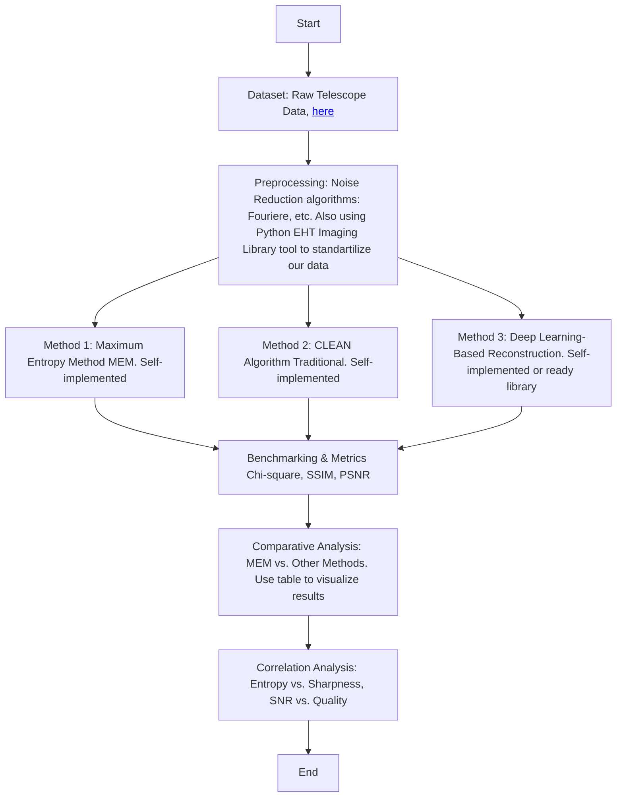

**Brief Explanation: Maximum Entropy Image Reconstruction for Astrophysics**

This numerical experiment explores the application of the **Maximum Entropy Method (MEM)** for reconstructing astrophysical images. The process begins with raw telescope data obtained from sources such as **radio interferometry (ALMA, VLA) or X-ray telescopes (Chandra)**. The dataset undergoes preprocessing, including **Fourier transformation and noise reduction**, to extract visibility functions for image reconstruction. The more information we find <a href='http://vlbiimaging.csail.mit.edu/imagingchallenge'>here</a>

Following preprocessing, three different reconstruction methods are applied:
1. **MEM:** Uses entropy maximization to generate the most probable image given the data constraints.
2. **CLEAN Algorithm:** A traditional deconvolution approach commonly used in radio astronomy.
3. **Deep Learning-Based Reconstruction:** Utilizes machine learning models trained on astrophysical datasets to enhance resolution.

After applying these methods, the results are evaluated using **benchmarking metrics** such as:
- **Chi-square goodnesPs of fit** to measure data consistency.
- **Structural Similarity Index (SSIM)** for image quality assessment.
- **Peak Signal-to-Noise Ratio (PSNR)** to quantify noise suppression.

A **comparative analysis** is performed to assess the strengths and weaknesses of each method. Additionally, a **correlation analysis** investigates relationships between entropy and image sharpness, as well as signal-to-noise ratio (SNR) and reconstruction quality.

The flowchart visually represents this process, illustrating the step-by-step progression from data acquisition to final analysis, ensuring a structured and repeatable approach for image reconstruction in astrophysics.

